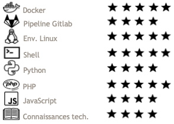

### Hi there 👋

I'm Crash-Zeus, a french 23 yo devOps  
You can find on this github some personal projects that I do aside of my work  

Some informations on me :
- I love my job
- I love coffee
- I work in a coffee society (this is developer dreams no ?)
- I love mountain bike and surf
- Linux life
- I love Docker so much <3

<!-- Soon : -->
<!-- - Golang -->
<!-- - Kubernetes -->
<!-- - New project : SSH manager gui build in python (debian packaged) -->
<!-- - Sonarqube -->

Contributions are open, do not hesitate to open issues or propose pull requests

---

### 
Stats

  
  

<!-- ---
### 
Skills

  

    
  

 -->

---
### 
Visitor

 

  

